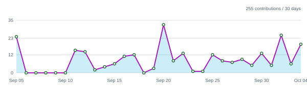

<picture>
  <source media="(prefers-color-scheme: dark)" srcset="x/babyalien.svg">
  <source media="(prefers-color-scheme: light)" srcset="x/babyalien.svg">
  
</picture>

<h2>👩‍🚀 Social</h2> 

 
 
 

 
 
 

 
 
<h2>☕ Coffee</h2>
 

<a href="https://pay.blink.sv/0xbabyalien">
  
  

  
<picture>
  <source media="(prefers-color-scheme: dark)" srcset="x/banner1-babyalien-svg-1500x500.svg">
  <source media="(prefers-color-scheme: light)" srcset="x/banner1-babyalien-svg-1500x500.svg">
  
</picture>  

  
📝 Template portfolio-001
 
    
    <a href="https://github.com/0xbabyalien/0x228a/tree/0xBabyAlien/template/portfolio-001" style="text-decoration: none;">
    github </a>
     — 
    <a href="https://0xbabyalien.vercel.app/template/portfolio-001/" style="text-decoration: none;">
    live demo </a> - 
    <a href="https://0xbabyalien.pages.dev/template/portfolio-001/" style="text-decoration: none;">
    live demo </a>
  
 
  

   
📝 Template projects-001
 
    
    <a href="https://github.com/0xbabyalien/virtual-office"> github </a>  —  
    <a href="https://0xbabyalien.github.io/virtual-office/"> live demo </a> 
      

 
<h2>📊 Stats</h2>
<picture>
  <source media="(prefers-color-scheme: dark)" srcset="assets/github-contribution-grid-snake-dark.svg" />
  <source media="(prefers-color-scheme: light)" srcset="assets/github-contribution-grid-snake.svg" />
  
</picture>
<picture>
  <source media="(prefers-color-scheme: dark)" srcset="./github-activity-30days.svg" />
  <source media="(prefers-color-scheme: light)" srcset="./github-activity-30days.svg" />
  
</picture>
   
<!-- STAT_START -->
📅 Daily commits: 1
🖥 Last update: 2026-10-05 19:01:58 UTC
<!-- STAT_END -->
  
<picture>
  <source media="(prefers-color-scheme: dark)" srcset="x/banner2-babyalien-svg-1500x500.svg">
  <source media="(prefers-color-scheme: light)" srcset="x/banner2-babyalien-svg-1500x500.svg">
  
</picture>

 
<!-- DAILY_QUOTE:START -->
🗯 Daily Quote :

Definitions belong to the definers, not the defined. — Toni Morrison

<!-- DAILY_QUOTE:END -->

